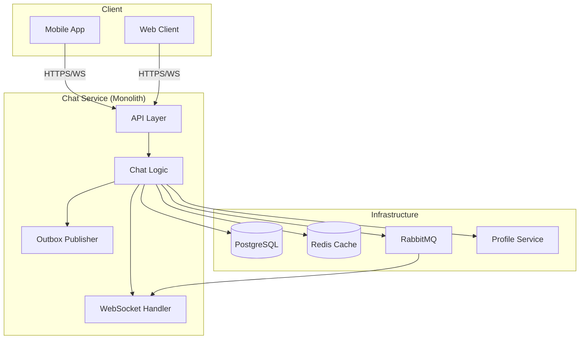

# Real-Time Chat System

A robust, scalable, and feature-rich real-time chat system designed for modern applications. Built on a microservices architecture, it ensures reliable message delivery, low latency, and a seamless user experience.

---

## Key Features

- **Real-Time Messaging**: Instant message delivery using WebSockets (STOMP).
- **Message History**: Paginated fetching of past conversations.
- **Delivery & Read Receipts**: Track when messages are delivered and seen by recipients.
- **Unread Message Count**: Endpoint to fetch the number of unread messages for a user.
- **Cross-Instance Scalability**: Uses RabbitMQ to relay messages between multiple application instances.
- **Guaranteed Delivery**: An outbox pattern ensures no messages are lost during failures.
- **Secure**: JWT-based authentication for both client requests and inter-service communication.

---

## Architecture Overview

The system is composed of several interconnected services that work together to provide a seamless chat experience.



**How it Works:**
1.  A client sends a message via a REST API.
2.  The **Chat Logic** validates and persists the message to **PostgreSQL**.
3.  It also creates an entry in an **Outbox** table.
4.  The **Outbox Publisher** (a background worker) picks up the pending entry and broadcasts it through **RabbitMQ**.
5.  **RabbitMQ** ensures the message reaches the correct **WebSocket Handler**, which then pushes it to the recipient's client in real-time.

---

## Core Components

| Component              | Responsibility                                                                                                     |
|------------------------|-------------------------------------------------------------------------------------------------------------------|
| **Chat Service**       | The central hub handling all chat-related business logic, API endpoints, and database interactions.                |
| **Profile Service**    | A separate service (or module) that fetches user profile information, with caching for performance.              |
| **Outbox Publisher**   | A reliable, scheduled background worker that guarantees message broadcasting to WebSocket clients.                |
| **WebSocket/STOMP**     | Manages persistent connections and uses topics/queues for targeted message delivery to users.                    |
| **RabbitMQ**           | A message broker that acts as the nervous system for distributing messages across different service instances.    |
| **PostgreSQL**         | The primary database for persisting chat sessions, messages, and the outbox for reliability.                    |

---

## 🛠️ Technology Stack

| Category               | Technologies                                                              |
|------------------------|---------------------------------------------------------------------------|
| **Backend**            | Java 17, Spring Boot, Spring Security, Spring WebSocket                   |
| **Database**           | PostgreSQL                                                                |
| **Cache**              | Redis (for profile data)                                                 |
| **Message Broker**     | RabbitMQ                                                                  |
| **Inter-Comm**         | REST (Feign Client), STOMP, RabbitMQ                                      |
| **Security**           | JWT (RSA-signed)                                                          |
| **Build & Deployment** | Docker, Kubernetes                                                        |
| **Monitoring**         | Prometheus, Grafana, ELK Stack                                           |

---

## 📨 The Life of a Message

1.  **Send**: A user sends a message via `POST /api/chat/message`.
2.  **Persist**: The `ChatService` saves the message to the `chat_messages` table.
3.  **Outbox**: Simultaneously, it writes a `ChatMessageOutbox` entry, containing the destination and payload.
4.  **Publish**: A scheduled `OutboxPublisher` claims unprocessed outbox entries and publishes them to a RabbitMQ exchange.
5.  **Relay & Broadcast**: The message is picked up by the `ChatMessageRelayListener` (or directly by the WebSocket broker) and broadcasted to the recipient's STOMP destination (e.g., `/topic/session.{sessionId}`).
6.  **Receive**: The recipient's connected client receives the message in real-time and updates the UI.
7.  **Acknowledge**: The recipient's client sends read/delivery status, which updates the original message in the database.

---

## Security

- **Client Authentication**: All API and WebSocket connections are protected by JWTs issued by a central authentication service.
- **Inter-Service Authentication**: Service-to-service calls (e.g., to the Profile Service) are secured using short-lived, RSA-signed JWTs.
- **Authorization**: The system ensures users can only access their own chat sessions and messages.

---

## Reliability & Scalability

- **Guaranteed Delivery**: The **Outbox Pattern** decouples message persistence from message broadcasting. If the WebSocket broker is down, the message remains in the outbox and is retried until successful.
- **Horizontal Scaling**: The stateless nature of the services allows for running multiple instances behind a load balancer. RabbitMQ ensures messages are routed correctly.
- **Automatic Retries**: Failed operations (like outbox publishing) are retried with exponential backoff.
- **Caching**: User profiles are cached in Redis to reduce latency and load on the Profile Service.

---

## Monitoring & Observability

- **Metrics**: Exposed via Micrometer for Prometheus. Key metrics include message rate, outbox queue size, and WebSocket connection count.
- **Logging**: Structured JSON logging provides a clear audit trail of all message operations.
- **Health Checks**: Spring Boot Actuator endpoints provide liveness and readiness information for Kubernetes.

---

## Getting Started (Local Development)

### Prerequisites
- Java 17+
- Docker & Docker Compose
- A running PostgreSQL, Redis, and RabbitMQ instance (Docker Compose recommended).

### Setup

1.  **Clone the repository**:
    ```bash
    git clone <repository-url>
    cd chat-service
    ```

2.  **Start Dependencies**:
    ```bash
    docker-compose up -d postgres redis rabbitmq
    ```

3.  **Run the Application**:
    ```bash
    ./mvnw spring-boot:run
    ```

The service will be available at `http://localhost:8080`.

---

## API Summary

| Method | Endpoint                               | Description                                |
|--------|----------------------------------------|--------------------------------------------|
| `POST` | `/api/chat/init`                      | Initializes or retrieves a chat session.   |
| `POST` | `/api/chat/message`                   | Sends a new message.                       |
| `GET`  | `/api/chat/history/{sessionId}`       | Fetches paginated history for a session.   |
| `GET`  | `/api/chat/unread/{sessionId}/{email}` | Gets unread messages for a user in a chat. |
| `POST` | `/ws`                                  | WebSocket endpoint for STOMP connections.  |

---

