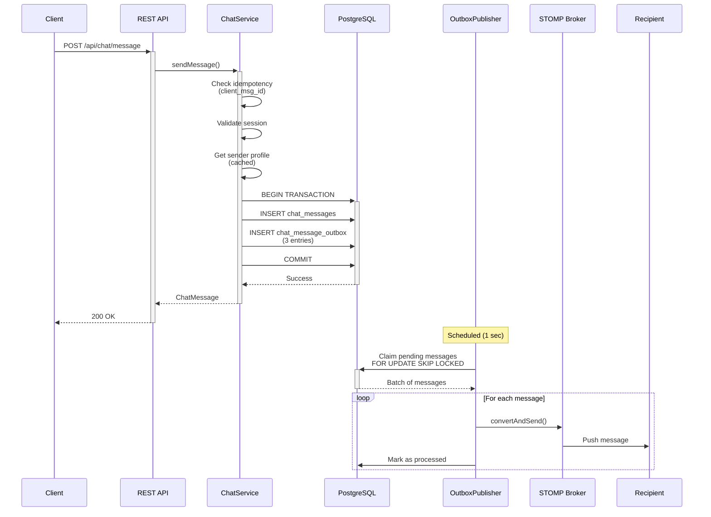
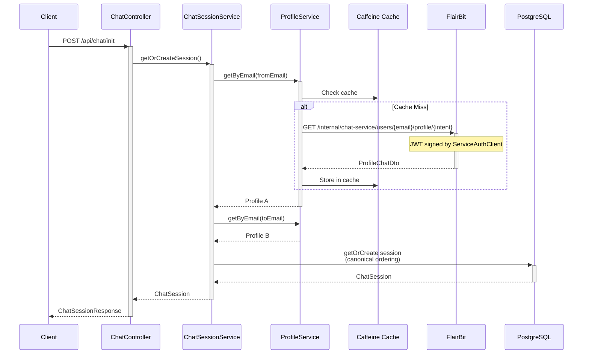
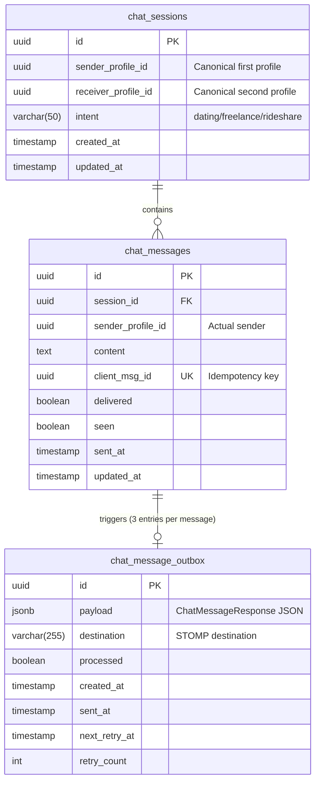
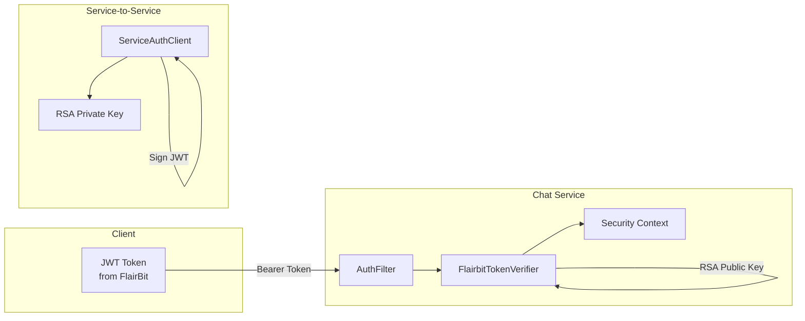
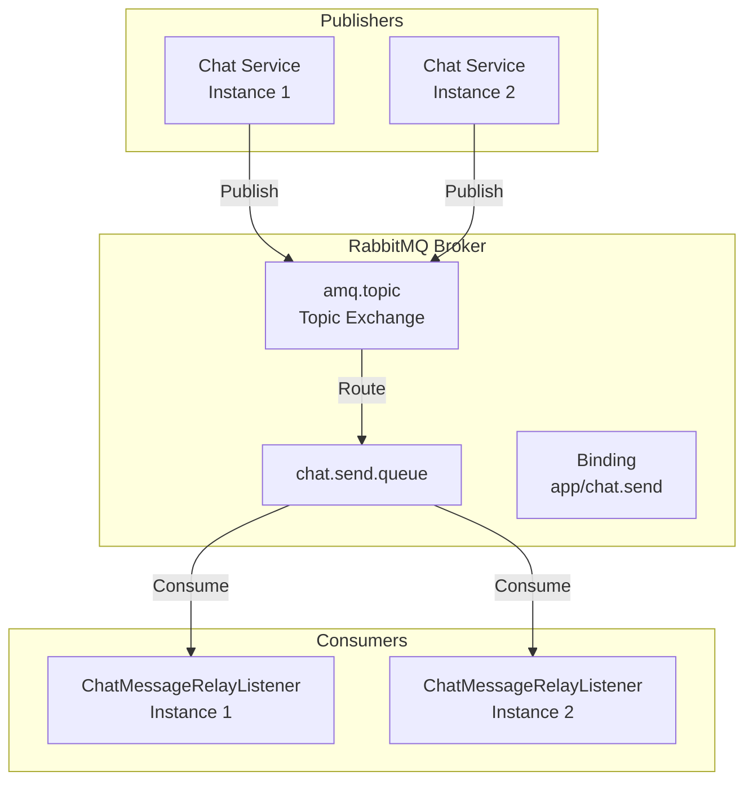
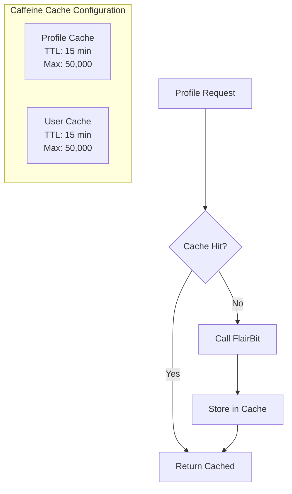
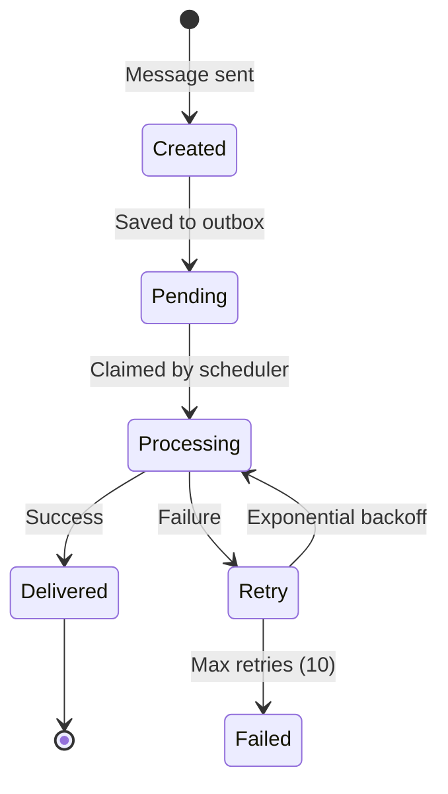

# High-Level Design (HLD): Real-Time Chat System

*Based on the existing codebase implementation*

## 1. Executive Summary

This document presents the high-level design of a real-time chat system currently implemented using Spring Boot, WebSocket/STOMP, and PostgreSQL. The system facilitates real-time messaging between users with different intents (dating, freelance, rideshare, etc.) and integrates with an external FlairBit service for user profile management and authentication.

## 2. System Architecture Overview

```mermaid
flowchart TD
    subgraph "Client Applications"
        WEB[Web Browser<br/>SockJS/STOMP Client]
        MOBILE[Mobile App<br/>WebSocket Client]
    end
    
    subgraph "Chat Service Application"
        subgraph "API Layer"
            REST_API[REST API<br/>ChatController<br/>/api/chat/*]
            WS_ENDPOINT[WebSocket Endpoint<br/>/ws<br/>STOMP Protocol]
        end
        
        subgraph "Service Layer"
            CHAT_SERVICE[ChatServiceImpl<br/>Message Processing]
            SESSION_SERVICE[ChatSessionService<br/>Session Management]
            PROFILE_SERVICE[ProfileService<br/>Profile Caching]
        end
        
        subgraph "Integration Components"
            RELAY_LISTENER[ChatMessageRelayListener<br/>@RabbitListener]
            OUTBOX_PUBLISHER[OutboxPublisher<br/>@Scheduled Poller]
            SERVICE_AUTH[ServiceAuthClient<br/>JWT Token Generator]
        end
        
        subgraph "Caching"
            CAFFEINE[Caffeine Cache<br/>Profile Cache<br/>User Cache]
        end
    end
    
    subgraph "External Services"
        FLAIRBIT[FlairBit Service<br/>User Profiles & Auth]
    end
    
    subgraph "Data & Messaging"
        POSTGRES[(PostgreSQL<br/>chat_sessions<br/>chat_messages<br/>chat_message_outbox)]
        RABBITMQ[RabbitMQ<br/>Message Broker<br/>chat.send.queue]
        STOMP_BROKER[STOMP Broker<br/>Embedded/Relay]
    end
    
    %% Client connections
    WEB -->|HTTPS/WSS| REST_API
    WEB -->|WebSocket| WS_ENDPOINT
    MOBILE -->|HTTPS/WSS| REST_API
    MOBILE -->|WebSocket| WS_ENDPOINT
    
    %% API to Service
    REST_API --> CHAT_SERVICE
    WS_ENDPOINT --> STOMP_BROKER
    
    %% Service interactions
    CHAT_SERVICE --> SESSION_SERVICE
    CHAT_SERVICE --> PROFILE_SERVICE
    SESSION_SERVICE --> PROFILE_SERVICE
    
    %% External integration
    PROFILE_SERVICE --> CAFFEINE
    PROFILE_SERVICE --> FLAIRBIT
    SERVICE_AUTH --> FLAIRBIT
    
    %% Data persistence
    CHAT_SERVICE --> POSTGRES
    SESSION_SERVICE --> POSTGRES
    OUTBOX_PUBLISHER --> POSTGRES
    
    %% Messaging
    RELAY_LISTENER --> RABBITMQ
    OUTBOX_PUBLISHER --> STOMP_BROKER
    STOMP_BROKER --> WS_ENDPOINT
    
    %% Styling
    classDef client fill:#FF9800,color:white
    classDef service fill:#4CAF50,color:white
    classDef external fill:#2196F3,color:white
    classDef data fill:#9C27B0,color:white
    
    class WEB,MOBILE client
    class CHAT_SERVICE,SESSION_SERVICE,PROFILE_SERVICE service
    class FLAIRBIT external
    class POSTGRES,RABBITMQ data
```

## 3. Current Implementation Components

### 3.1 Core Components

| Component | Implementation | Purpose |
|-----------|---------------|---------|
| **ChatController** | REST API | Handles HTTP requests for chat operations |
| **ChatServiceImpl** | Service Layer | Core business logic for message processing |
| **ChatSessionService** | Service Layer | Manages chat session creation and retrieval |
| **ProfileService** | Service Layer | Caches and retrieves user profiles from FlairBit |
| **OutboxPublisher** | Scheduled Task | Ensures reliable message delivery via outbox pattern |
| **ChatMessageRelayListener** | RabbitMQ Listener | Processes messages from RabbitMQ queue |

### 3.2 Configuration Components

| Configuration | Purpose |
|--------------|---------|
| **WebSocketConfig** | Configures STOMP over WebSocket with SockJS fallback |
| **RabbitConfig** | Sets up RabbitMQ queues, exchanges, and bindings |
| **SecurityConfig** | JWT-based authentication and authorization |
| **CaffeineConfig** | In-memory caching for profiles and users |
| **FeignConfig** | HTTP client configuration for FlairBit integration |

## 4. Data Flow Architecture

### 4.1 Message Send Flow (Current Implementation)



### 4.2 Session Initialization Flow



## 5. Database Schema (As Implemented)



## 6. Security Architecture (Current)

### 6.1 Authentication Flow



### 6.2 Security Implementation

- **User Authentication**: JWT tokens issued by FlairBit, verified using RSA public key
- **Service Authentication**: Inter-service calls use JWT signed with service's RSA private key
- **Authorization**: Spring Security with method-level security (`@EnableMethodSecurity`)
- **WebSocket Security**: JWT validation on connection establishment

## 7. Messaging Architecture

### 7.1 RabbitMQ Configuration



### 7.2 STOMP/WebSocket Configuration

- **Broker Type**: Configurable (Embedded or External Relay)
- **Endpoints**: `/ws` with SockJS fallback
- **Message Prefixes**:
    - Application destination: `/app`
    - User destination: `/user`
    - Broker destination: `/topic`, `/queue`

## 8. Caching Strategy (Current)



## 9. Resilience Patterns (Implemented)

### 9.1 Outbox Pattern



### 9.2 Circuit Breaker

- **Implementation**: Resilience4j Circuit Breaker for FlairBit client
- **Configuration**:
    - Failure threshold: 50%
    - Wait duration in open state: 5s
    - Sliding window size: 10
    - Half-open calls: 3

## 10. API Specification (Current)

### 10.1 REST Endpoints

| Method | Endpoint | Description |
|--------|----------|-------------|
| POST | `/api/chat/init` | Initialize chat session |
| POST | `/api/chat/message` | Send a message |
| GET | `/api/chat/{sessionId}/history` | Get message history |
| GET | `/api/chat/{sessionId}/unread` | Get unread messages |

### 10.2 WebSocket/STOMP Destinations

| Type | Destination | Description |
|------|------------|-------------|
| Subscribe | `/topic/session.{sessionId}` | Receive session messages |
| Subscribe | `/user/queue/messages` | Personal message queue |
| Subscribe | `/user/queue/ack` | Message acknowledgments |
| Subscribe | `/user/queue/error` | Error notifications |
| Send | `/app/chat.send` | Send message via WebSocket |

## 11. System Characteristics

### 11.1 Scalability Features

- **Stateless Design**: Chat service instances are stateless
- **Horizontal Scaling**: Multiple instances can run concurrently
- **Database Optimization**:
    - Indexes on frequently queried columns
    - Partial index for outbox pending messages
    - FOR UPDATE SKIP LOCKED for concurrent processing

### 11.2 Reliability Features

- **Idempotency**: Client message ID prevents duplicates
- **Transactional Outbox**: Guarantees message delivery
- **Retry Mechanism**: Exponential backoff for failed messages
- **Connection Resilience**: SockJS fallback for WebSocket

## 12. Monitoring & Observability (Configured)

### 12.1 Key Metrics Points

- **OutboxPublisher**: Processed and failed counters
- **Database Triggers**: Auto-update timestamps
- **Circuit Breaker**: State transition events
- **Thread Pool**: Configurable worker threads for outbox processing

### 12.2 Operational Considerations

- **Batch Processing**: Outbox processes messages in batches (500 default)
- **Polling Interval**: 1-second fixed delay for outbox
- **Cache Metrics**: Hit/miss rates available via Caffeine stats
- **Connection Limits**: Configurable RabbitMQ consumer concurrency (4-10)

## 13. Deployment Considerations

### 13.1 Environment Configuration

```yaml
Required Environment Variables:
- DB_USERNAME, DB_PASSWORD
- RABBITMQ_HOST, RABBITMQ_USER, RABBITMQ_PASS
- FLAIRBIT_URL
- SERVICE_PRIVATE_KEY (path to RSA key)
- FLAIRBIT_PUBLIC_KEY (path to RSA public key)
```

### 13.2 Infrastructure Requirements

| Component | Requirement |
|-----------|------------|
| PostgreSQL | Version 13+ with UUID support |
| RabbitMQ | Version 3.8+ with management plugin |
| Java Runtime | Java 17+ |
| Memory | 2-4 GB per instance |
| CPU | 2-4 cores per instance |

## 14. System Strengths

1. **Reliability**: Outbox pattern ensures no message loss
2. **Performance**: Multi-level caching reduces external calls
3. **Security**: Proper JWT validation with RSA keys
4. **Flexibility**: Supports multiple intent types
5. **Maintainability**: Clean separation of concerns

## 15. Potential Improvements

1. **Redis Integration**: Add distributed caching for session state
2. **Metrics**: Implement comprehensive Micrometer metrics
3. **Tracing**: Add distributed tracing with Sleuth/Zipkin
4. **Rate Limiting**: Implement per-user rate limiting
5. **Message Encryption**: Add end-to-end encryption option
6. **Bulk Operations**: Support batch message sending
7. **Presence System**: Real-time online/offline status

## 16. Conclusion

The current implementation provides a solid foundation for a real-time chat system with:

- **Core Functionality**: Complete message sending, delivery, and history
- **Reliability**: Transactional outbox pattern for guaranteed delivery
- **Integration**: Clean integration with FlairBit service
- **Real-time**: WebSocket/STOMP for instant messaging
- **Security**: JWT-based authentication and authorization

