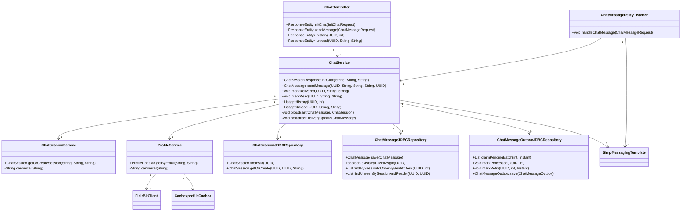
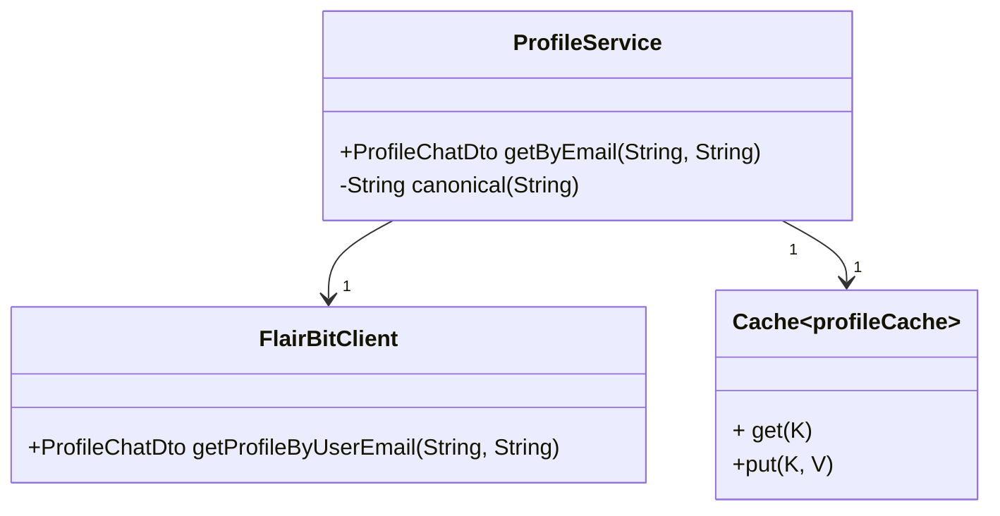
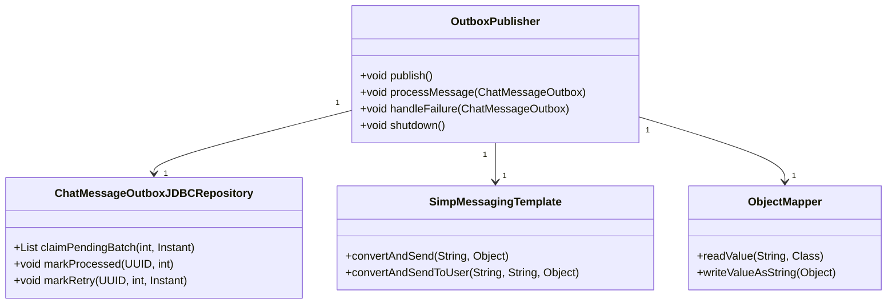
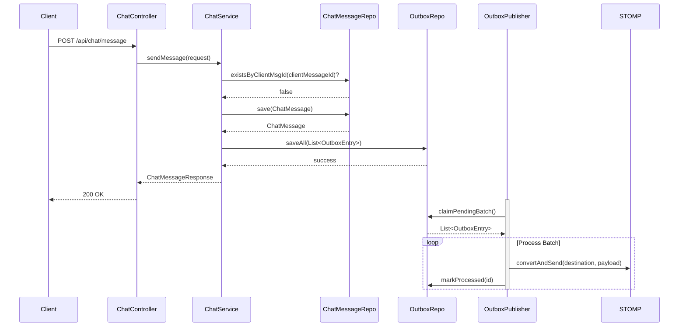
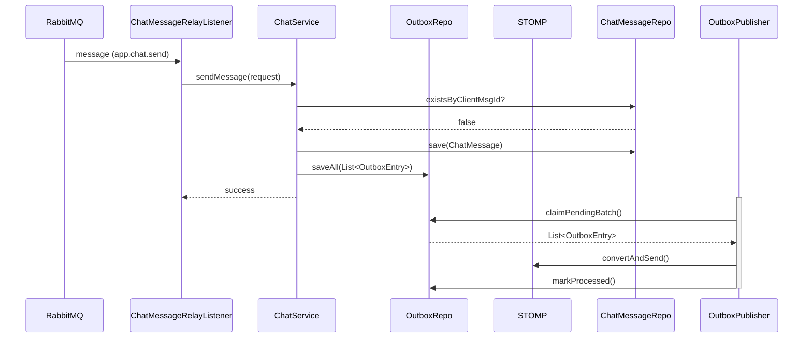

### Low-Level Design (LLD): Real-Time Chat System

---

## 1. Introduction

This **Low-Level Design (LLD)** document details the **implementation-level design** for the Real-Time Chat System described in the High-Level Design (HLD). It covers:

- **Class diagrams** for key components.
- **API contracts** (REST, STOMP, RabbitMQ).
- **Data flow sequences** for critical operations.
- **Database schema** and access patterns.
- **Error handling**, **caching**, **security**, and **scalability** strategies.

---

## 2. System Overview

The system is built on a **microservices** architecture with the following **core modules**:

| Module                | Responsibility                                                                 |
|-----------------------|--------------------------------------------------------------------------------|
| **Chat Service**      | Business logic for chat operations, message persistence, and broadcasting.     |
| **Profile Service**   | Fetches user profiles from FlairBit (with caching).                           |
| **Outbox Publisher**  | Guarantees reliable message delivery to WebSocket clients.                    |
| **WebSocket/STOMP**   | Manages real-time connections and message brokering.                          |
| **RabbitMQ**          | Cross-instance message relay for scalability.                                 |
| **Security**          | JWT generation/validation for service-to-service and client-to-service auth.  |
| **Database**          | PostgreSQL for persistent storage of chats, messages, and outbox.             |

---

## 3. Component Design

### 3.1 Chat Service

#### 3.1.1 Class Diagram



#### 3.1.2 Key Classes & Methods

| Class                     | Description                                                                                  | Key Methods                                                                 |
|---------------------------|----------------------------------------------------------------------------------------------|-----------------------------------------------------------------------------|
| `ChatController`          | Exposes REST APIs for chat operations.                                                       | `initChat`, `sendMessage`, `history`, `unread`                              |
| `ChatServiceImp`          | Core business logic. Handles message persistence, validation, and broadcasting.             | `sendMessage`, `markDelivered`, `markRead`, `getHistory`, `getUnread`        |
| `ChatSessionService`      | Manages chat sessions between users. Ensures uniqueness based on participants and intent.   | `getOrCreateSession`                                                        |
| `ProfileService`          | Fetches user profiles from FlairBit with caching.                                            | `getByEmail`                                                                |
| `ChatMessageRelayListener`| Listens to RabbitMQ for cross-instance messages and relays them via STOMP.                   | `handleChatMessage`                                                         |
| `ChatMessageOutboxJDBCRepository` | Custom repository for outbox pattern (claims pending messages for processing). | `claimPendingBatch`, `markProcessed`, `markRetry`                          |

---

### 3.2 Profile Service

#### 3.2.1 Class Diagram



#### 3.2.2 Flow: Fetching a Profile

1. **Cache Check**:  
   `ProfileService.getByEmail(email, intent)` generates a cache key (`email + "|" + intent`).
    - If found in **Caffeine Cache**, return the cached `ProfileChatDto`.

2. **Remote Call**:
    - If not cached, call `FlairBitClient.getProfileByUserEmail(email, intent)`.
    - The Feign client adds a **JWT token** (generated by `ServiceAuthClient`) to the request header.

3. **Cache & Return**:
    - Store the response in the cache (TTL = 15 minutes).
    - Return the profile.

---

### 3.3 Outbox Publisher

#### 3.3.1 Class Diagram



#### 3.3.2 Workflow

1. **Scheduled Job** (`@Scheduled(fixedDelay = 1000)`):
    - Calls `outboxRepo.claimPendingBatch()` to fetch **unprocessed** messages (using `SELECT ... FOR UPDATE SKIP LOCKED`).
    - Processes messages in **parallel** using a fixed thread pool (`parallelWorkers = CPUs + 1`).

2. **Processing a Message**:
    - Deserialize `payload` (JSON) to `ChatMessageResponse`.
    - Send to the appropriate destination:
        - **User-specific queue**: `convertAndSendToUser(user, destination, payload)`
        - **Topic**: `convertAndSend(destination, payload)`
    - Mark the outbox entry as **processed**.

3. **Failure Handling**:
    - On failure, **exponential backoff** is applied (min 60s).
    - Update `next_retry_at` and increment `retry_count`.
    - After **10 retries**, log for manual inspection.

---

### 3.4 WebSocket / STOMP

#### 3.4.1 Configuration

```java
@Configuration
@EnableWebSocketMessageBroker
public class WebSocketConfig implements WebSocketMessageBrokerConfigurer {

    @Value("${app.websocket.broker-type:embedded}")
    private String brokerType;

    @Override
    public void configureMessageBroker(MessageBrokerRegistry registry) {
        if ("relay".equalsIgnoreCase(brokerType)) {
            // Use RabbitMQ as STOMP broker
            registry.enableStompBrokerRelay("/topic", "/queue")
                    .setRelayHost("rabbitmq")
                    .setRelayPort(61613)
                    .setClientLogin("guest")
                    .setClientPasscode("guest");
        } else {
            // Use embedded broker
            registry.enableSimpleBroker("/topic", "/queue");
        }
        registry.setApplicationDestinationPrefixes("/app");
    }

    @Override
    public void registerStompEndpoints(StompEndpointRegistry registry) {
        registry.addEndpoint("/ws")
                .setAllowedOriginPatterns("*")
                .withSockJS(); // Fallback to HTTP for browsers without WebSocket
    }
}
```

#### 3.4.2 STOMP Endpoints

| Endpoint          | Purpose                                                                 | Destination Prefixes       |
|-------------------|-------------------------------------------------------------------------|----------------------------|
| `/ws`             | WebSocket entry point (with SockJS fallback).                            | `/app` (for sending)       |
| `/topic/session.{chatId}` | Broadcast messages to all participants of a chat.                  | `/topic` (for broadcasting)|
| `/user/queue/ack` | User-specific queue for message delivery acknowledgments.             | `/queue` (for user queues) |
| `/user/queue/error` | User-specific queue for error notifications.                       | `/queue`                   |

---

### 3.5 RabbitMQ

#### 3.5.1 Configuration

```java
@Configuration
@EnableRabbit
public class RabbitConfig {

    public static final String QUEUE_NAME = "chat.send.queue";
    public static final String EXCHANGE_NAME = "amq.topic";
    public static final String ROUTING_KEY = "app.chat.send";

    // Queue, Exchange, and Binding
    @Bean
    public Queue chatSendQueue() {
        return QueueBuilder.durable(QUEUE_NAME).build();
    }

    @Bean
    public TopicExchange topicExchange() {
        return new TopicExchange(EXCHANGE_NAME);
    }

    @Bean
    public Binding binding(Queue queue, TopicExchange exchange) {
        return BindingBuilder.bind(queue).to(exchange).with(ROUTING_KEY);
    }

    // Listener Container Factory (with retries, concurrency, etc.)
    @Bean
    public SimpleRabbitListenerContainerFactory rabbitListenerContainerFactory(
            ConnectionFactory connectionFactory,
            Jackson2JsonMessageConverter converter) {

        SimpleRabbitListenerContainerFactory factory = new SimpleRabbitListenerContainerFactory();
        factory.setConnectionFactory(connectionFactory);
        factory.setMessageConverter(converter);
        factory.setConcurrentConsumers(4);
        factory.setMaxConcurrentConsumers(10);
        factory.setPrefetchCount(25);
        factory.setDefaultRequeueRejected(false);
        return factory;
    }
}
```

#### 3.5.2 Message Format

Messages sent to RabbitMQ are of type `ChatMessageRequest`:

```json
{
  "sessionId": "f81d4fae-7dec-11d0-a765-00a0c9b4d51",
  "senderEmail": "alice@example.com",
  "intent": "dating",
  "content": "Hello!",
  "clientMessageId": "c1234567-89ab-cdef-0123-456789abcdef"
}
```

---

### 3.6 Security

#### 3.6.1 JWT Generation (Service-to-Service)

```java
@Component
public class ServiceAuthClient {
    private final RSAKey privateKey;
    private final String serviceName;

    public String createToken(String subject) {
        JWTClaimsSet claims = new JWTClaimsSet.Builder()
                .issuer(serviceName)
                .subject(subject)
                .issueTime(new Date())
                .expirationTime(new Date(System.currentTimeMillis() + 120_000)) // 2 mins
                .build();

        SignedJWT jwt = new SignedJWT(
                new JWSHeader.Builder(JWSAlgorithm.RS256).keyID(privateKey.getKeyID()).build(),
                claims
        );
        jwt.sign(new RSASSASigner(privateKey.toPrivateKey()));
        return jwt.serialize();
    }
}
```

#### 3.6.2 JWT Verification (FlairBit Tokens)

```java
@Component
public class FlairbitTokenVerifier {
    private final RSAPublicKey publicKey;

    public JWTClaimsSet verifyAndExtract(String token) {
        SignedJWT signedJWT = SignedJWT.parse(token);
        JWSVerifier verifier = new RSASSAVerifier(publicKey);
        if (!signedJWT.verify(verifier)) throw new SecurityException("Invalid signature");
        JWTClaimsSet claims = signedJWT.getJWTClaimsSet();
        if (new Date().after(claims.getExpirationTime())) throw new SecurityException("Token expired");
        return claims;
    }
}
```

#### 3.6.3 Client Authentication

- Clients authenticate with a **user JWT** (issued by an Auth Service).
- The `SecurityConfig` enforces JWT validation for all APIs except `/auth/**`.

```java
@Bean
public SecurityFilterChain filterChain(HttpSecurity http) throws Exception {
    http
        .csrf(AbstractHttpConfigurer::disable)
        .authorizeHttpRequests(auth -> auth
            .requestMatchers("/auth/**").permitAll()
            .requestMatchers("/ws/**", "/api/**").hasAuthority("USER")
            .anyRequest().authenticated()
        )
        .sessionManagement(session -> session.sessionCreationPolicy(SessionCreationPolicy.STATELESS))
        .addFilterBefore(authFilter, UsernamePasswordAuthenticationFilter.class);
    return http.build();
}
```

---

### 3.7 Database

#### 3.7.1 Schema (Liquibase)

```xml
<!-- chat_sessions -->
<createTable tableName="chat_sessions">
    <column name="id" type="UUID"><constraints primaryKey="true"/></column>
    <column name="sender_profile_id" type="UUID"/><constraints nullable="false"/>
    <column name="receiver_profile_id" type="UUID"/><constraints nullable="false"/>
    <column name="intent" type="VARCHAR(50)"/><constraints nullable="false"/>
    <column name="created_at" type="TIMESTAMP WITH TIME ZONE" defaultValueComputed="CURRENT_TIMESTAMP"/>
</createTable>
<addUniqueConstraint tableName="chat_sessions" columnNames="sender_profile_id, receiver_profile_id, intent"/>

<!-- chat_messages -->
<createTable tableName="chat_messages">
    <column name="id" type="UUID"><constraints primaryKey="true"/></column>
    <column name="session_id" type="UUID"/><constraints nullable="false"/>
    <column name="sender_profile_id" type="UUID"/><constraints nullable="false"/>
    <column name="content" type="TEXT"/><constraints nullable="false"/>
    <column name="client_msg_id" type="UUID"/><constraints unique="true"/>
    <column name="delivered" type="BOOLEAN" defaultValueBoolean="false"/>
    <column name="seen" type="BOOLEAN" defaultValueBoolean="false"/>
    <column name="sent_at" type="TIMESTAMP WITH TIME ZONE" defaultValueComputed="CURRENT_TIMESTAMP"/>
</createTable>

<!-- chat_message_outbox -->
<createTable tableName="chat_message_outbox">
    <column name="id" type="UUID"><constraints primaryKey="true"/></column>
    <column name="destination" type="VARCHAR(255)"/><constraints nullable="false"/>
    <column name="payload" type="JSONB"/><constraints nullable="false"/>
    <column name="created_at" type="TIMESTAMP WITH TIME ZONE" defaultValueComputed="CURRENT_TIMESTAMP"/>
    <column name="sent_at" type="TIMESTAMP WITH TIME ZONE"/>
    <column name="processed" type="BOOLEAN" defaultValueBoolean="false"/>
    <column name="retry_count" type="INT" defaultValueNumeric="0"/>
    <column name="next_retry_at" type="TIMESTAMP WITH TIME ZONE" defaultValueComputed="CURRENT_TIMESTAMP"/>
</createTable>
```

#### 3.7.2 Access Patterns

| Operation                          | SQL Query                                                                                             |
|------------------------------------|-------------------------------------------------------------------------------------------------------|
| **Save Message**                   | `INSERT INTO chat_messages (...) VALUES (...) RETURNING *;`                                           |
| **Check Duplicate Client Message** | `SELECT 1 FROM chat_messages WHERE client_msg_id = ?;`                                                |
| **Get History**                    | `SELECT * FROM chat_messages WHERE session_id = ? ORDER BY sent_at DESC LIMIT ?;`                     |
| **Get Unread Messages**            | `SELECT * FROM chat_messages WHERE session_id = ? AND sender_profile_id != ? AND (delivered = false OR seen = false);` |
| **Claim Outbox Batch**             | `SELECT * FROM chat_message_outbox WHERE processed = false AND next_retry_at <= NOW() ORDER BY created_at LIMIT ? FOR UPDATE SKIP LOCKED;` |

---

## 4. Data Flow Sequences

### 4.1 Send a Message



### 4.2 Relay Message Across Instances



---

## 5. Error Handling & Retries

| Scenario                          | Handling                                                                                     |
|-----------------------------------|----------------------------------------------------------------------------------------------|
| **Duplicate Client Message ID**   | Ignored; return existing message.                                                            |
| **FlairBit Service Down**          | Fallback to cached profile. If cache miss, return `503 Service Unavailable`.                |
| **STOMP Delivery Failure**         | Outbox entry retried with exponential backoff. After 10 retries, marked for manual review.   |
| **RabbitMQ Connection Lost**       | `ChatMessageRelayListener` pauses listening, retries on connection recovery.                 |
| **Database Timeout**               | Retry via Spring’s `@Retryable`; fallback to queue for later processing.                     |

---

## 6. Performance & Scalability

| Component          | Optimization Strategy                                                                 |
|--------------------|----------------------------------------------------------------------------------------|
| **Caching**        | `Caffeine` cache for FlairBit profiles (15‑min TTL, 50k entries).                       |
| **Outbox**         | Parallel processing with fixed thread pool; batch claiming.                              |
| **RabbitMQ**       | Durable queues, topic exchange for flexible routing, prefetch count tuning.              |
| **Database**       | Indexes on `session_id`, `sent_at`, `client_msg_id`; read replicas for heavy reads.      |
| **WebSocket**      | STOMP over RabbitMQ for distributed messaging; user-specific queues for targeted delivery.|

---

## 7. Monitoring & Observability

| Aspect            | Tool/Technique                                                                          |
|-------------------|-----------------------------------------------------------------------------------------|
| **Metrics**       | Prometheus + Grafana (message rates, latency, cache hit‑rate, RabbitMQ queue depth).    |
| **Logging**       | ELK Stack (structured JSON logs).                                                       |
| **Tracing**       | Jaeger for distributed tracing across services.                                          |
| **Health Checks** | Kubernetes liveness/readiness probes; DB & RabbitMQ health endpoints.                   |

---

## 8. Deployment

- **Docker Images**: Each service (chat, profile, outbox) packaged as Docker images.
- **Kubernetes**:
    - Deployments for `chat-service` (with HPA based on CPU & RabbitMQ queue depth).
    - RabbitMQ StatefulSet with persistent volume.
    - PostgreSQL with read replicas.
    - Ingress (NGINX) for external access.
- **Helm Charts**: For declarative deployment to any K8s cluster.

---


