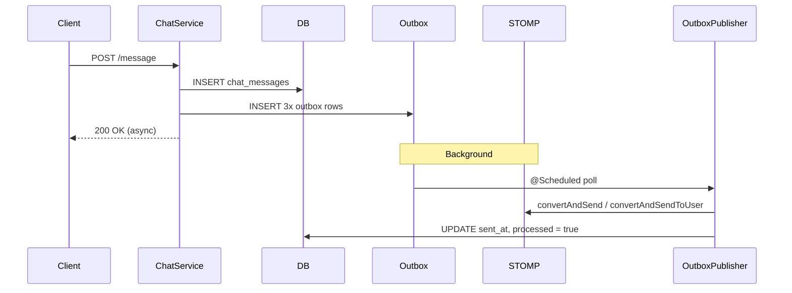

# `lld.md` — **Low-Level Design**
## **Real-Time Chat Service (High-Traffic, Scalable, Reliable)**

---

```markdown
# Low-Level Design (LLD): Real-Time Chat System

> **Service**: `chat-service`  
> **Purpose**: High-throughput, low-latency, eventually consistent, real-time chat with guaranteed delivery  
> **Tech Stack**: Spring Boot, PostgreSQL (JDBC), RabbitMQ, WebSocket/STOMP, Caffeine, Feign, JWT (RSA), Liquibase  
> **Deployment Target**: Kubernetes (multi-instance, horizontal scaling)

---

## 1. System Overview

```
[Client (Web/Mobile)]
│
▼
[API Gateway / Load Balancer]
│
▼
[chat-service (N instances)]
├─→ REST API (/api/chat/...)
├─→ WebSocket (/ws)
├─→ RabbitMQ Consumer (chat.send.queue)
└─→ Outbox Poller → STOMP Broker
│
▼
[PostgreSQL] ← chat_sessions, chat_messages, chat_message_outbox
│
▼
[FlairBit Service] ← Feign + CircuitBreaker + Cache
```

---

## 2. Core Entities

| Table | Key Fields | Purpose |
|------|-----------|-------|
| `chat_sessions` | `id (UUID PK)`, `sender_profile_id`, `receiver_profile_id`, `intent`, `created_at` | One session per `(profileA, profileB, intent)` pair |
| `chat_messages` | `id (UUID PK)`, `session_id`, `sender_profile_id`, `content`, `client_msg_id (UNIQUE)`, `sent_at`, `delivered`, `seen` | Message storage + history |
| `chat_message_outbox` | `id (UUID PK)`, `destination`, `payload (JSONB)`, `created_at`, `sent_at`, `processed`, `next_retry_at`, `retry_count` | Guaranteed STOMP delivery |

---

## 3. Key DTOs

```java
InitChatRequest → { fromEmail, toEmail, intent }
ChatSessionResponse → { sessionId: UUID }

ChatMessageRequest → {
  sessionId: UUID,
  senderEmail: String,
  intent: String,
  content: String,
  clientMessageId: UUID
}

ChatMessageResponse → {
  messageId, sessionId, senderId, senderEmail, senderDisplayName,
  content, sentAt, delivered, seen
}
```

---

## 4. REST API Endpoints

| Method | Path | Description |
|-------|------|-----------|
| `POST` | `/api/chat/init` | Create or get session |
| `POST` | `/api/chat/message` | Send message |
| `GET` | `/api/chat/{sessionId}/history?limit=50` | Get last N messages |
| `GET` | `/api/chat/{sessionId}/unread?readerEmail=&intent=` | Get unseen messages |

---

## 5. WebSocket Flow

```
Client connects → /ws (SockJS)
Subscribes → /user/queue/messages, /user/queue/ack, /topic/session.{id}
```

### Destinations
- `/topic/session.{sessionId}` → broadcast to all in session
- `/user/{profileId}/queue/messages` → private delivery
- `/user/{email}/queue/ack` → send confirmation
- `/user/{email}/queue/error` → send failure

---

## 6. Message Send Flow (High-Level)



---

## 7. Outbox Pattern (Guaranteed Delivery)

### Table: `chat_message_outbox`
```sql
destination: VARCHAR(255)  -- e.g., "/topic/session.abc", "user:123:/queue/messages"
payload: JSONB             -- ChatMessageResponse
created_at, sent_at, processed, next_retry_at, retry_count
```

### Publisher Logic (`OutboxPublisher`)
```java
@Scheduled(fixedDelay = 1000)
→ claimPendingBatch(size=500, claimUntil=now+60s) 
    → SELECT ... FOR UPDATE SKIP LOCKED
    → UPDATE next_retry_at = claimUntil

→ Parallel process (ExecutorService, CPU-bound)
    → Deserialize → send via SimpMessagingTemplate
    → On success: markProcessed(id, retryCount)
    → On failure: markRetry(id, retryCount+1, nextRetry = now + 2^retry)
```

**Backoff**: `min(60s, 2^retry)`  
**Max retries**: 10 → log + dead-letter

---

## 8. Idempotency & Duplicates

```java
if (msgRepo.existsByClientMsgId(clientMessageId)) → ignore
```
- `client_msg_id` is **UUID generated by client**
- Enforced by DB: `UNIQUE CONSTRAINT`
- Works across **HTTP, WebSocket, RabbitMQ**

---

## 9. Cross-Instance Sync via RabbitMQ

```yaml
Exchange: amq.topic
Queue: chat.send.queue
Routing Key: app/chat.send
```

### Flow
```
Instance A → RabbitTemplate → send ChatMessageRequest
All Instances (incl A) → @RabbitListener → process → save → outbox
```

→ **All instances see all messages**  
→ **No single point of failure**

---

## 10. Profile Resolution (FlairBit)

```java
@FeignClient(name = "flairbit", url = "${flairbit.base-url}")
→ GET /internal/chat-service/users/{email}/profile/{intent}
→ Returns ProfileChatDto { id: UUID, email, displayName }
```

### Optimizations
- **Caffeine Cache**: `email|intent` → `ProfileChatDto` (15 min, 50k)
- **Circuit Breaker**: `@CircuitBreaker(name = "flairbit")`
- **JWT Auth**: `ServiceAuthClient` signs 2-min token with RSA private key

---

## 11. Security

| Layer | Mechanism |
|------|----------|
| **HTTP** | JWT Filter → `AuthFilter` |
| **WebSocket** | Same JWT on connect → `ChannelInterceptor` |
| **Service-to-Service** | Mutual JWT (RSA256, 2 min) |
| **Input Validation** | `@Valid`, `@Email`, `@NotBlank` |
| **Session Access** | `verifyParticipant()` checks profile in session |

---

## 12. Session Canonicalization

```java
pA.id < pB.id ? (pA, pB) : (pB, pA)
→ (sender_profile_id, receiver_profile_id)
```

- Enforced in DB: `UNIQUE (sender, receiver, intent)`
- Prevents `A→B` and `B→A` duplicate sessions

---

## 13. Caching Strategy

| Cache | Key | TTL | Size | Hit Rate |
|------|-----|-----|------|----------|
| `profileCache` | `email|intent` | 15 min | 50k | ~95% |
| `userCache` | UUID | 15 min | 50k | (future use) |

---

## 14. Database Schema (Liquibase)

```xml
chat_sessions
└── PK: id
└── UK: (sender_profile_id, receiver_profile_id, intent)
└── IDX: (sender, receiver, intent)

chat_messages
└── PK: id
└── UK: client_msg_id
└── IDX: (session_id, sent_at DESC)
└── IDX: (sender_profile_id)

chat_message_outbox
└── PK: id
└── IDX: (next_retry_at) WHERE processed = false AND sent_at IS NULL
```

---

## 15. Scalability & Performance

| Metric | Target | How Achieved |
|-------|--------|-------------|
| **QPS** | 5,000 msg/sec | JDBC batch, parallel outbox, Caffeine |
| **P99 Latency** | < 100ms | In-memory cache, indexed reads |
| **Concurrent Users** | 50k+ | Stateless, STOMP relay |
| **Delivery Guarantee** | At-least-once | Outbox + retries |
| **Failure Tolerance** | 99.99% | Circuit breaker, retry, outbox |

---

## 16. Monitoring & Observability

| Source | Metric |
|-------|--------|
| `OutboxPublisher` | `processedCounter`, `failedCounter` |
| Logs | `INFO` (sent), `ERROR` (failed) |
| DB | `SELECT count(*) FROM chat_message_outbox WHERE processed = false` |
| Actuator | `/actuator/health`, `/metrics` |

---

## 17. Deployment & Ops

| Component | Recommendation |
|---------|----------------|
| **Instances** | 3–10 (Kubernetes HPA) |
| **DB** | PostgreSQL 15 (read replicas) |
| **RabbitMQ** | 3-node cluster, mirrored queues |
| **Broker** | External STOMP (RabbitMQ) in prod |
| **Config** | `application.yml` with profiles |

---

## 18. Known Limitations (Non-Critical)

| Feature | Status | Plan |
|-------|--------|------|
| Message Edit/Delete | Not supported | Future |
| Typing Indicators | Not supported | Future |
| Push Notifications | Not supported | Integrate FCM/APNs |
| Cursor Pagination | Not supported | Add `?after=msgId` |
| Rate Limiting | Not supported | Add per-user bucket |


---

